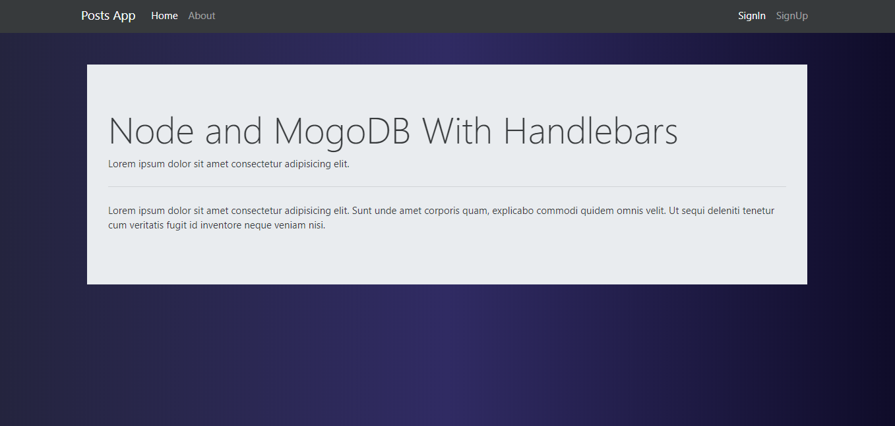
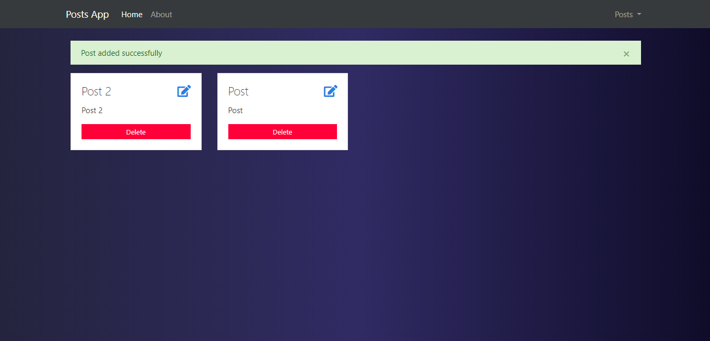

# Website con NodeJS, MongoDB y Handlebars
Aplicación basica usando NodeJS.

Tecnologías:
- NodeJS.
- MongoDB.
- Handlebars.

Módulos:
- Framework: `npm i express`.
- Motor de plantillas: `npm i handlebars` `npm i express-handlebars` `npm i @handlebars/allow-prototype-access`.
- Crear sessiones en el servidor: `npm i express-session`.
- Extiende las funcionalidades de los forms get, post, put, delete: `npm i method-override`.
- Conectar express a una base de datos: `npm i mongoose`.
- Autenticar usuarios: `npm i passport` (facebook, google, etc) y `npm i passport-local` (forma local servidor).
- Cifrar contraseñas: `npm i bcryptjs`.
- Mensajes flash: `npm i connect-flash`.
- Visualiza por consola las peticiones que van llegando por servidor `npm i morgan`.
- Reinicia el servidor automaticamente al guardar cambios `npm i nodemon -D`.
- Integra variables de entorno `npm i dotenv -D`.
- Supervisa si hay nuevos mudulos o actualizaciones `npm i npm-checkaupdates -D`.

Esta app puede:
- Crear/Leer/Actualizar/Eliminar Post.
- Permite a un usuario iniciar sesión y guardar sus posts personales.

# Screenshot

# Guía de instalación
1. Descarga el repositorio.
2. Descomprime la carpeta dentro del directorio que desees.
3. Renombra la carpeta (Opcional).
4. Entra a la carpeta desde la terminal `cd directorio/de/la/carpeta`.
5. Copia el contenido del archivo `.env.example` a un nuevo archivo llamado `.env`.
    * Si estás en Linux o Mac puedes ejecutar el comando: `cp .env.example .env`.
6. Crea una base de datos para el proyecto en MongoDB Local (Software utilizado Robo 3T).
7. Modifica las variables de entorno del nuevo archivo `.env`.
    * Define los datos de conexión.
        * `MONGODB_HOST`=
        * `MONGODB_DATABASE`=
8. Ejecuta `npm install`.
9. Ejecuta `npm run dev`.
10. Abre la aplicación en el navegador con `http://localhost:3000`.
11. Registra un nuevo usuario y ya puedes comenzar a utilizar la aplicación.

# License

#### Todos los proyectos creados por Alex Ku Dzul están bajo la [licencia MIT](https://opensource.org/licenses/MIT).